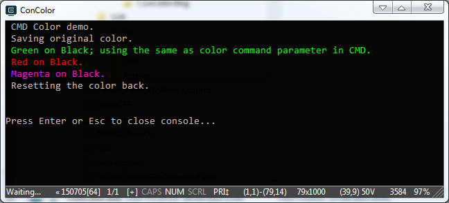

# Console Color Class
-----
#### C++ windows CMD coloring library.

>Ery E. Wahyutama -- erick[dot]wahyutama[at]gmail[dot]com

This library provides support for coloring CMD console window in windows operating system.


Just by **putting** it in **std::cout** or **std::wcout** and you're ready to go, as easy as pie.
You can even preserve original color and restore it later.

What you can do with this library
but just to make life easier, declare alias for namespace
```cpp
namespace con = ConsoleColor;
```

- Preserve original CMD color.
```cpp
// all you have todo just declare it, and you're have the original color
con::Color OriginalColor;
```
- Using color command as seen in CMD as parameter
```cpp
// setting up green on a black background using parameter
// the parameter is in hex 
std::cout << con::Color(0x0A) << "Green text on Black background" << std::endl;
```
- Using predefined enumeration provided by the library
```cpp
std::cout << con::Color(con::color::HiRed, con::color::Black) << "Red text on Black background" << std::endl;
// or you can use the previous color
std::cout << con::Color(con::color::HiRed, con::color::Previous) << "Red text on the same background as previous" << std::endl;
// the same also goes for the foreground color
std::cout << ConColor(con::color::Previous, con::color::Black) << "Red text on the same background as previous" << std::endl;
```
- Restore any previously saved color
```cpp
std::cout << OriginalColor;
```

here is the complete example:
```cpp
int main()
{
    namespace con = ConsoleColor;
    std::cout << " CMD Color demo." << std::endl;
    std::cout << " Saving original color." << std::endl;
    con::Color OriginalColor;
    std::cout << con::Color(0x0A) << " Green on Black; using the same as color command parameter in CMD." << std::endl;
    std::cout << con::Color(con::color::HiRed, con::color::Black) << " Red on Black." << std::endl;
    std::cout << con::Color(con::color::HiMagenta, con::color::Previous) << " Magenta on Black." << std::endl;
    std::cout << OriginalColor << " Resetting the color back." << std::endl;
    return 0;
}
```

which will produce this output:



### Like my work?
please consider a donation through paypal via email addres above.


*Feel free to use this library for any purposes.*
